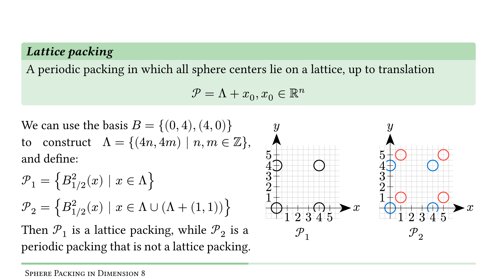
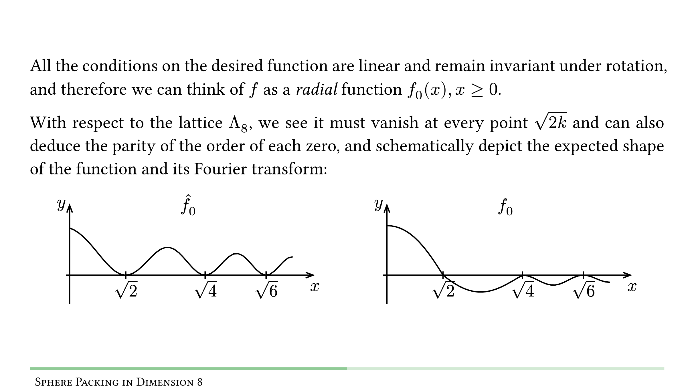
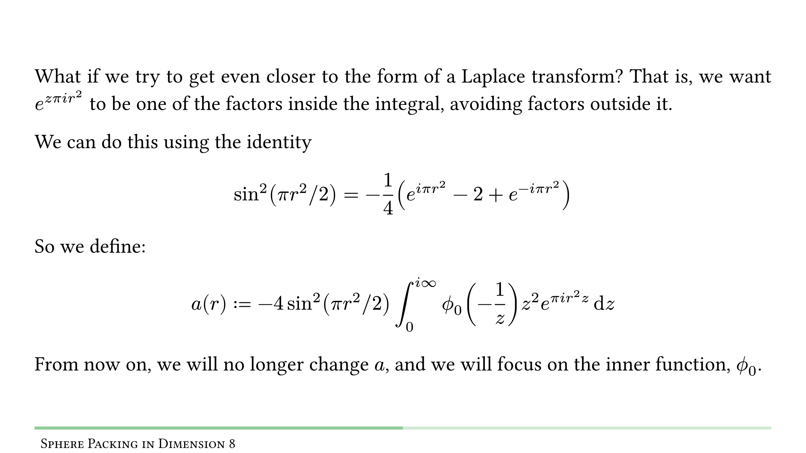

## Background

The sphere packing problem seeks the optimal arrangement of identical spheres in space.  
In $\mathbb{R}^8$, this problem was solved by Maryna Viazovska in 2016 ([paper](https://arxiv.org/abs/1603.04246)), earning her the Fields Medal in 2022.

As part of my undergraduate seminar, I wrote a detailed explanation of this proof which assumes only undergraduate-level knowledge of mathematics (mainly linear algebra and complex analysis). The work was originally written in Hebrew and later translated into English.

- [English presentation](./eng/seminar_presentation.pdf)  
- [English document](./eng/seminar.pdf)  
- [Hebrew presentation](./heb/seminar_presentation.pdf)  
- [Hebrew document](./heb/seminar.pdf)  

---

## Seminar on Sphere Packing in Dimension 8

Sphere packing is a geometric problem with a seemingly simple question:  
**What is the most efficient way to arrange identical spheres in space?**

<p align="center">
    
</p>

### Topics Covered:

- **Mathematical Foundations**:
  - Definitions of sphere packing, lattices, and density, focusing on the $E_8$ lattice.
  - Modular forms and Eisenstein series.
  - Schwartz functions, Fourier transforms in $\mathbb{R}^n$, and the Poisson summation formula.

- **Proof Overview**:
  1. Linear programming bounds by [Cohn and Elkies (2003)](https://arxiv.org/abs/math/0110009).
  2. Constructing a function using a Laplace transform and $\sin(\pi|x|^2/2)$ and manipulate it to find the how the magic function should look like.
  3. Show the construction in [Viazovska (2016)](ttps://arxiv.org/abs/1603.04246) of the magic function and proof of its key properties.

### Sample Slides:

<p align="center">
    
    
    
</p>


## Building

To build the PDFs, install [`typst`](https://github.com/typst/typst) (version `0.12.0`), and run the following commands:

```bash
typst compile eng/seminar/main.typ eng/seminar.pdf
typst compile eng/seminar_presentation/main.typ eng/seminar_presentation.pdf
typst compile heb/seminar/main.typ heb/seminar.pdf
typst compile heb/seminar_presentation/main.typ heb/seminar_presentation.pdf
```
